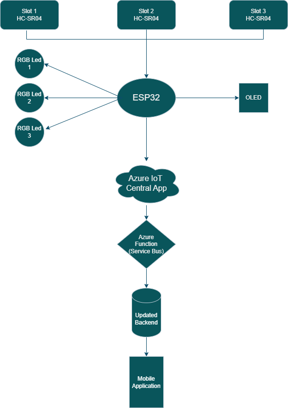

# 🚗 Smart Car Parking System with Sensor-Based Slot Detection

## Project Overview

This project implements a **Smart Car Parking System** using IoT technologies. The system uses ESP32 microcontrollers with ultrasonic sensors to detect parking slot availability in real-time. The data is sent to Azure IoT Central for centralized monitoring, and a backend system manages parking sessions, fee calculations, and user interactions through a mobile app.

---

## Features

- Real-time vehicle detection with HC-SR04 ultrasonic sensors.
- Wireless communication using ESP32 and MQTT protocol.
- Cloud integration with Azure IoT Central and Azure Service Bus.
- Serverless backend using Azure Functions for event-driven updates.
- Parking session tracking and dynamic fee calculation.
- Secure and scalable backend with C# .NET and Microsoft SQL Server.
- User-friendly mobile app built with React Native and Expo.
- Visual parking status indicators with RGB LEDs and LCD displays.

---

## System Architecture

  
*Figure: Overview of the system components and data flow.*

Main components:

- **HC-SR04 Ultrasonic Sensors:** Detect vehicle presence in each slot.
- **ESP32 Microcontroller:** Collects sensor data and sends to cloud.
- **RGB LEDs and LCD Display:** Indicate slot status visually.
- **Azure IoT Central:** Central cloud platform for real-time data monitoring.
- **Azure Service Bus & Functions:** Event-driven backend updates.
- **Backend Server (C# .NET):** Handles business logic, database operations, and APIs.
- **Mobile App (React Native + Expo):** Provides parking info and session management to users.

---

## Getting Started

### Hardware Setup

- Connect HC-SR04 sensors to ESP32 development boards.
- Configure RGB LEDs and LCD display for visual feedback.
- Ensure Wi-Fi connectivity on ESP32 to communicate with Azure IoT Central.

### Software Setup

1. **Backend:**
   - Requires .NET runtime.
   - Configure connection strings for Microsoft SQL Server.
   - Deploy Azure Function with Service Bus trigger.

2. **Mobile App:**
   - Developed with React Native and Expo.
   - Configure backend API endpoints.
   - Run on Android/iOS devices.

3. **Azure Setup:**
   - Create IoT Central Application.
   - Set up devices and telemetry.
   - Configure Service Bus and Function triggers.

---

## Communication Protocols

- **MQTT:** For ESP32 to Azure IoT Central communication.
- **HTTP/JSON:** For backend and Azure Function interactions.
- Event-driven architecture ensures scalability and low latency.

---

## Results

- Accurate real-time detection of parking slot occupancy.
- Reliable backend session and fee management.
- Intuitive mobile app interface for end-users.
- Scalability with cloud-native components.
